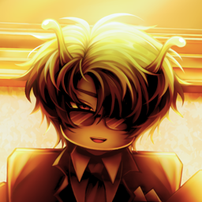
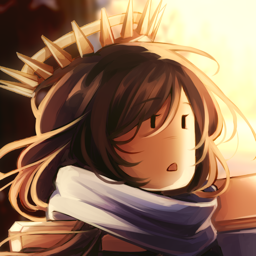
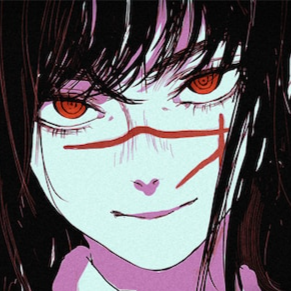
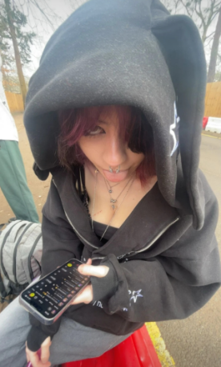

# 🎮 Novam Studios

### Creativity · Teamwork · Professionalism

**Building immersive Roblox experiences.**

---

*"Creating games that players enjoy and developers are proud to build."*

 

## 🌟 About Us

Novam Studios is a Roblox development organization focused on creating unique, polished, and immersive experiences.

We bring together talented developers, designers, artists, and creators to collaborate on ambitious projects while maintaining professional standards and strong teamwork.

Our mission is simple:

* 🎨 Create memorable experiences
* 🤝 Build a collaborative development culture
* 🚀 Support developer growth
* 💎 Deliver high-quality projects

---

## 🌟 Our Values

### 🎨 Creativity

We encourage innovation, experimentation, and original ideas.

### 🤝 Teamwork

Great projects are built by great teams working together.

### 💼 Professionalism

Organization, communication, and quality are at the core of everything we do.

---

## 🎯 Our Vision

Our ambition is to become a recognized and respected name within the Roblox development community by consistently delivering exceptional experiences for players and opportunities for developers.

---

## 🏆 Leadership

<table>
<tr>

<td align="center">
<a href="https://github.com/TheSpectraDev">
 
<b>Spectra</b>
</a> 
CEO
</td>

<td align="center">
<a href="https://github.com/putridsouls">
 
<b>Putrid</b>
</a> 
Co-Founder & Creative Director
</td>

<td align="center">
<a href="https://github.com/yoru-on-dc">
 
<b>Yoru</b>
</a> 
Community Director
</td>

<td align="center">
<a href="https://github.com/glitch-bny">
 
<b>Bny</b>
</a> 
Legal Manager
</td>

</tr>
</table>

---

## 🚀 What You'll Find Here

Most Novam Studios repositories remain private while projects are actively developed.

Public repositories may include:

* 🛠️ Open-source tools
* 📚 Documentation
* ⚙️ Development frameworks
* 🧪 Experimental projects
* 🌐 Community resources

---

## 🛠️ Technologies

Roblox Studio • Luau • Rojo • Knit • Fusion • Roact • TypeScript • GitHub Actions

---

## 📢 Connect With Us

💬 Discord: https://discord.gg/novam

🌐 Website: https://novamstudios.com

---

### ❤️ Thank You

Special thanks to all developers, artists, builders, composers, testers, and community members who help make Novam Studios possible.

 

**⭐ Thanks for visiting our organization!**

*"Building immersive Roblox experiences together."*

